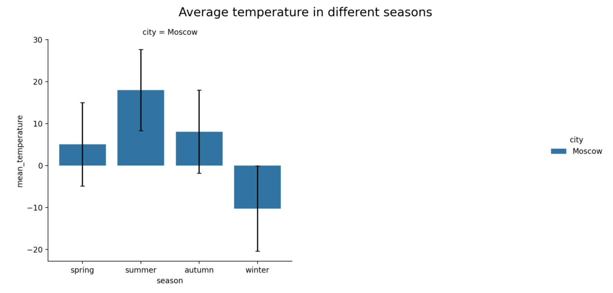

# OpenWeatherMap Weather App

Приложение позволяет получить текущую температуру в любом крупном (и не очень) городе мира.
1. Введите токен для сервиса OpenWeatherMap. Должно появиться сообщение, что токен рабочий.

2. В следующем поле введите город и нажмите Enter. Должна появиться информация следующего типа:

3. Выберите файл с историческими данными. Файл должен содержать колонки:

`city,timestamp,temperature,season`

После загрузки файла должна появиться следующая информация:

4. На боковой панели вы можете выбрать временной интервал, который следует учитывать для расчета статистик, и добавить другие города из введенного датасета для сравнения исторических данных

